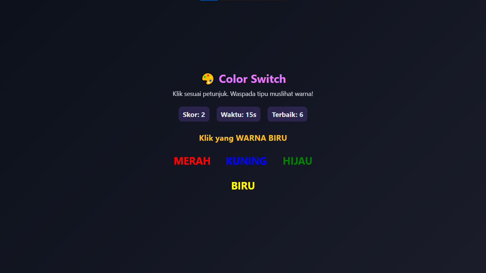

# 🎨 Color Switch  

Game edukatif berbasis **HTML, CSS, dan JavaScript**.  
Ujilah fokus dan konsentrasimu dengan memilih warna yang benar sesuai instruksi yang diberikan.  

---

## ✨ Fitur
- ⏳ Waktu bermain 30 detik  
- 🏆 Skor terbaik (**tersimpan otomatis di browser**)  
- 🎯 Instruksi acak:  
  - "Klik yang WARNA ..." → berdasarkan warna teks  
  - "Klik yang TERTULIS ..." → berdasarkan kata yang ditampilkan  
- ⚡ Gameplay cepat dengan efek langsung jika salah  
- 📱 Bisa dimainkan langsung di browser tanpa instalasi  

---

## 🚀 Cara Menjalankan
1. Clone repository ini:
   ```bash
   git clone https://github.com/username/color-switch.git
Masuk ke folder project: cd color-switch
Jalankan game dengan membuka file Game Colour.html di browser favoritmu.
✅ Tidak perlu instalasi tambahan.

## ⌨️ Cara Bermain
Ikuti instruksi yang muncul di layar:
-Jika tertulis "Klik yang WARNA MERAH", pilih teks yang berwarna merah (bukan tulisannya).
-Jika tertulis "Klik yang TERTULIS HIJAU", pilih teks yang bertuliskan kata HIJAU.
-Jawab secepat mungkin untuk mengumpulkan skor sebelum waktu habis.
-Jika salah memilih, permainan langsung berakhir.

## 📸 Screenshot


## 🌐 Main Online
